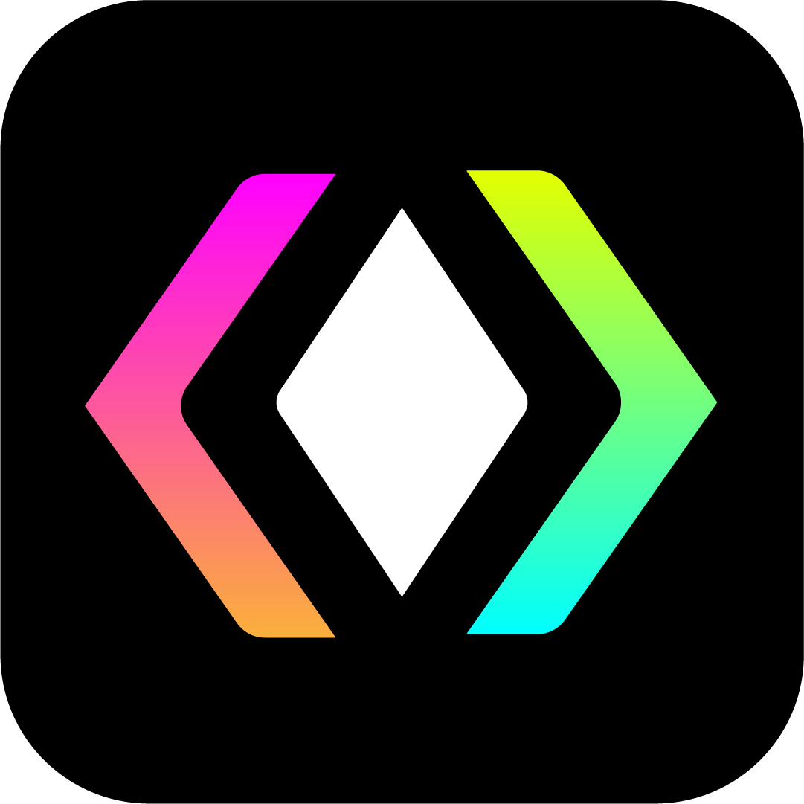

  

<h3 align="center">Open Dev Net</h3>

  <b>The Social Networking Platform for Developers and Designers.</b>

    

  <h4>
  <a href="https://opendevnet.com">Open Dev Net</a> · <a href="https://opendevnet.com/changelog">Changelog</a> · <a href="https://opendevnet.com/internal-docs">Internal Docs</a>
  </h4>
  

 

## Open Dev Net

Open Dev Net is the open-source social platform for developers to collaborate, find opportunities, and streamline workflows. This repository contains the source code for the Open Dev Net website, which is built primarily with TypeScript and Rust.

## Documentation

You can find the documentation for Open Dev Net in the [Internal Docs](https://opendevnet.com/internal-docs/) section of the website. This documentation is intended for internal use only. If you are looking for documentation on how to use the Open Dev Net API, please visit the [Developer Docs](https://opendevnet.com/dev/docs).

## Contributing

We welcome contributions from everyone! Please read our [Contributing Guidelines](.github/CONTRIBUTING.md) for more details.

To setup up the development environment variables, run `./run.sh dev setup env` and then run `./run.sh dev check` to make sure everything is setup correctly.

### Frontend

We use [pnpm](https://pnpm.io/) to manage dependencies and run scripts.

You can start development by running `pnpm run dev` in the root directory. This will build all of internal libraries and run the development server for each application.

### Backend

We use [cargo](https://doc.rust-lang.org/cargo/) to manage dependencies and run scripts. Before starting the development server, there are some pre-requisites:

1. To run [PostgreSQL](https://www.postgresql.org/), [pgAdmin](https://www.pgadmin.org/), and [Redis](https://redis.io/) locally, you can either run them with docker-compose by running `./run.sh dev start` or install them manually.
2. Create a database named `opendevnet`.
3. Install [sqlx-cli](https://github.com/launchbadge/sqlx), by running `cargo install sqlx-cli`.
4. Run `sqlx migrate run` in the `api` directory to run the database migrations.

You can start development by running `cargo run` in the root directory. This will build the internal crates and run the development server.

## License

Open Dev Net is licensed under [CC BY-NC-SA 4.0](https://creativecommons.org/licenses/by-nc-sa/4.0/).

## Contact

If you have any questions or need further assistance, feel free to contact the project maintainer or open an issue in this repository.

## Reference

- [Code of Conduct](.github/CODE_OF_CONDUCT.md)
- [Contributing Guidelines](.github/CONTRIBUTING.md)
- [License](LICENSE)
